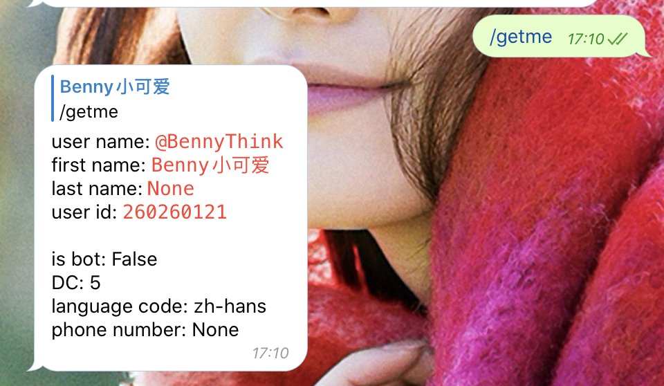
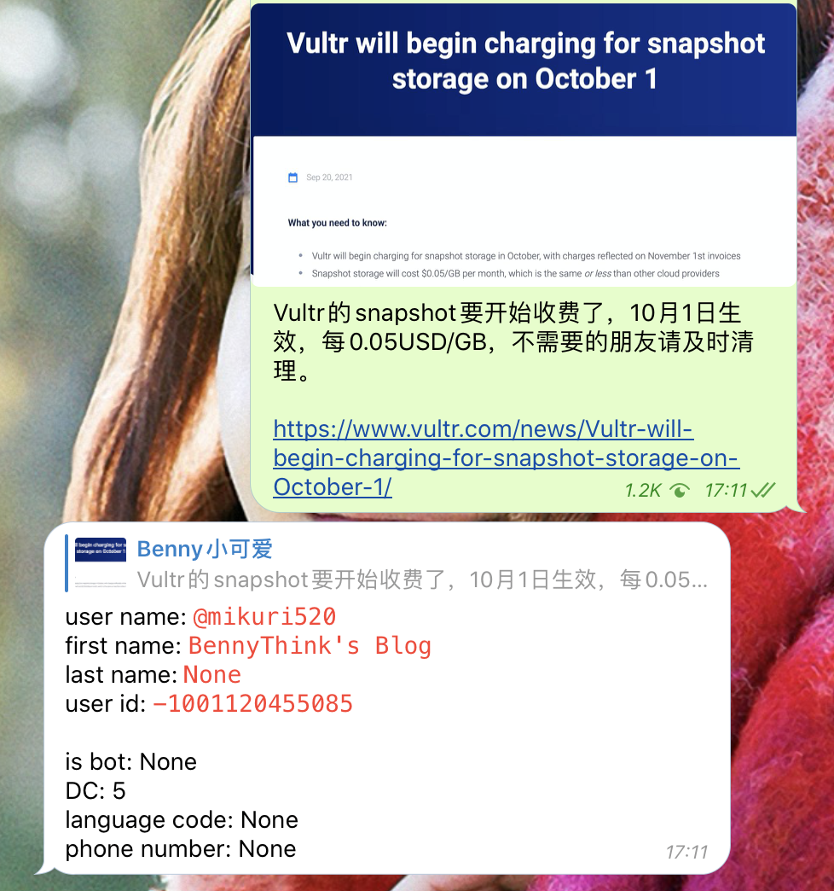
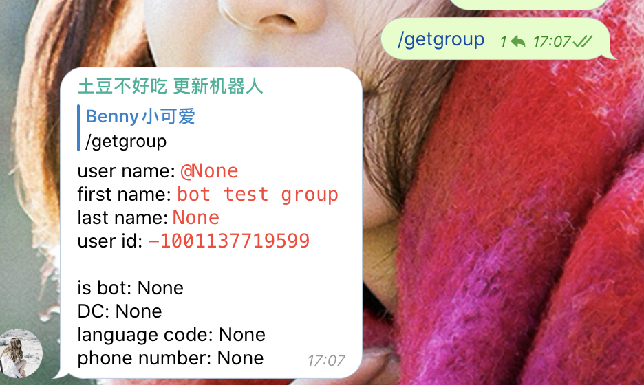

# IDBot

Get Telegram ID

# command

```text
start - start
help - help
getme - get your account info
getgroup -get group info(please add it to the group first)
```

# features

## get important details

* support forwards as well



## get channel and group




## get username

Support the following formats:

* BennyThink
* @BennyThink
* https://t.me/BennyThink
  
  


# LICENSE
Apache License Version 2.0